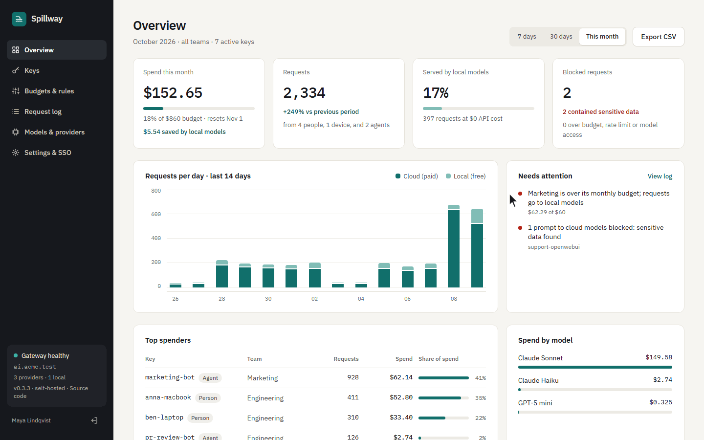
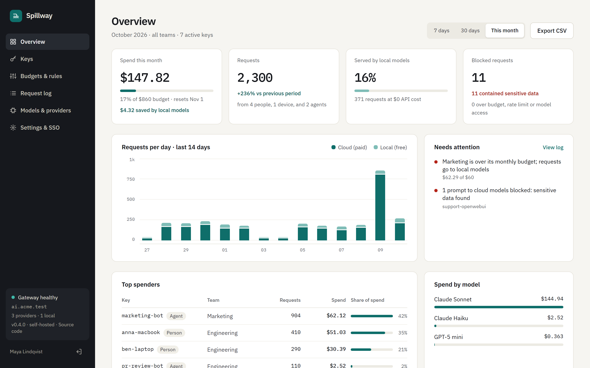
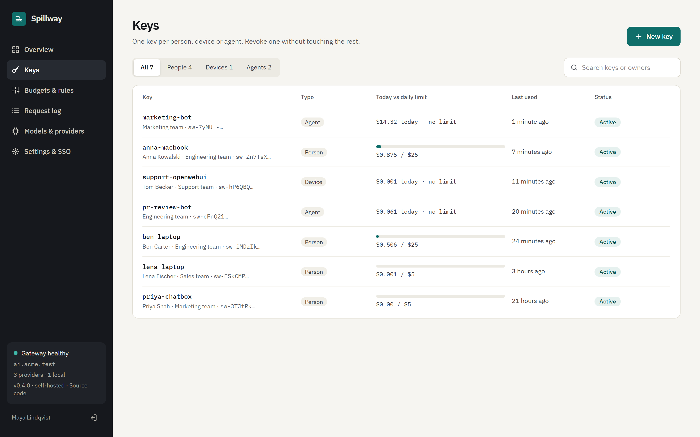
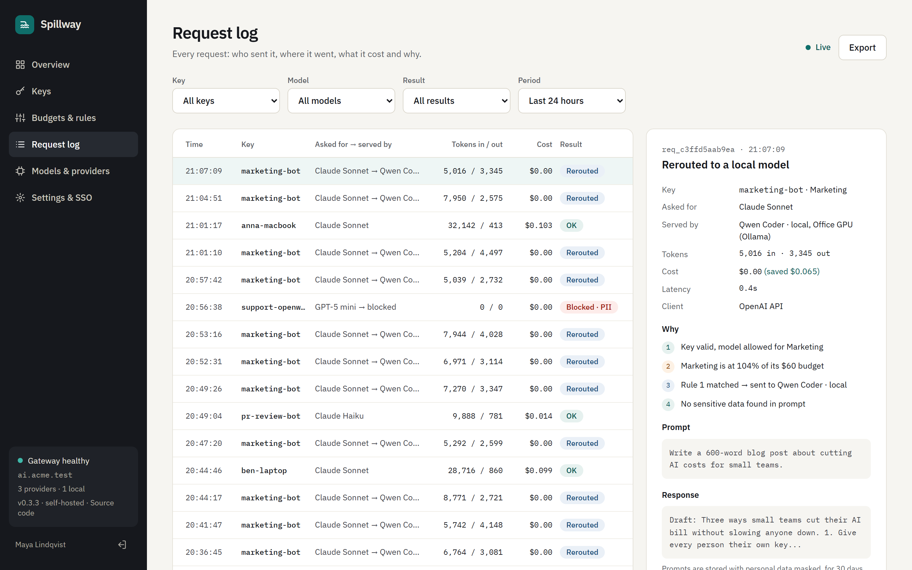

<p align="center">
  
</p>

<h1 align="center">Spillway</h1>

<p align="center"><b>Self-hosted AI gateway for small teams</b></p>

<p align="center">
  <a href="https://github.com/Artemy-And/spillway/actions/workflows/ci.yml?query=branch%3Adevelop"></a>
  <a href="https://github.com/Artemy-And/spillway/releases/latest"></a>
  <a href="LICENSE"></a>
</p>

A self-hosted AI gateway for companies without a DevOps team. Give every person, device and agent its
own key, set daily and monthly limits, send over-budget traffic to a local model instead of blocking
it, and keep a log of every request with personal data masked. Single sign-on is included and free.

If you looked at LiteLLM or Portkey but have nobody to run them, Spillway is the smaller option: one
container with an admin UI and SQLite inside.



```
 Claude Code ─┐
 Codex       ─┤                       ┌─ Anthropic
 Open WebUI  ─┼─▶  Spillway  ─────────┼─ OpenAI-compatible APIs
 n8n, SDKs   ─┘   keys · budgets      └─ Ollama on your own GPU
                  rules · masked log
```

Try it with one command, then open the setup link it prints to create the admin account:

```sh
docker run -d --name spillway -p 8080:8080 -v spillway-data:/data \
  --add-host host.docker.internal:host-gateway ghcr.io/artemy-and/spillway
docker logs spillway    # First start: create the admin account at http://localhost:8080/setup?code=…
```

For a setup you keep, use [Docker Compose](#quick-start).

## What it does

- **Three API formats in, any provider out.** Clients speak OpenAI (`/v1/chat/completions`,
  `/v1/responses`, `/v1/embeddings`), Anthropic (`/v1/messages`) or Ollama (`/api/chat`,
  `/api/generate`, `/api/embed`). Spillway translates between them, including streaming and tool
  calls, so Claude Code and Codex can run on a local Qwen when the budget runs out. Providers:
  OpenAI, Anthropic and Ollama, plus Azure OpenAI, Gemini, Mistral, Groq, DeepSeek, xAI and
  OpenRouter from a list, or any OpenAI-compatible API by its URL.
- **A key per person, device or agent** with daily and monthly dollar limits, and model allowlists
  per team and per key. Prices of well-known models fill in when you add them, and a cloud model
  without a price is flagged instead of quietly counting as free.
- **The cloud goes down, work does not.** When a provider fails, times out or rate limits, the
  local model answers instead, and the provider shows up under Needs attention.
- **Team budgets and four routing rules**: switch to the local model at N% of the team budget, keep
  card numbers, IBANs, US Social Security and UK National Insurance numbers, passport numbers and
  API keys away from cloud models, rate limit agents, and keep off-hours traffic local. Numbers that
  need context, like passports, only count next to the word itself, so timestamps and IDs in code
  never block a request.
- **Alerts where you already are.** Slack, Microsoft Teams or email when a team nears or passes
  its budget, a key hits its limit, or a provider goes down and comes back, plus a Monday summary
  of spend and savings.
- **An optional response cache.** The same key sending the same request again gets the stored
  answer for free; handy for n8n workflows and re-indexing documents. Off by default, and it never
  keeps prompts with personal data.
- **Every decision explained.** Each log entry shows the steps the gateway took ("Marketing is at
  104% of its budget → sent to Qwen Coder · local"), tokens, cost, and money saved.
- **Privacy by default.** Prompts are stored masked, text is dropped after a retention period (the
  numbers stay), storage can be switched off, and provider keys are encrypted at rest.
- **SSO without an enterprise plan**: Google Workspace, Microsoft Entra ID or any OpenID Connect
  provider.
- **In six languages**: English, Russian, German, French, Spanish and Chinese, picked from the
  browser and switchable on the sign-in and Account pages.

## What stays free

Single sign-on, keys, budgets and limits, the routing rules (local fallback, personal data, rate
limits, off-hours), alerts, the response cache, the request log and all three API formats are free
and stay in this repository under AGPL-3.0. If paid options come later, they will be new things
around Spillway, such as a managed instance or support. Nothing on this list will move behind a paywall.

## Quick start

```sh
mkdir spillway && cd spillway
curl -fsSLO https://raw.githubusercontent.com/Artemy-And/spillway/main/docker-compose.yml
docker compose up -d
docker compose logs spillway    # prints the setup link
```

This pulls the signed image `ghcr.io/artemy-and/spillway` for amd64 or arm64; nothing is built
on your machine. `latest` follows releases. To pin one, put `SPILLWAY_TAG=0.3.2` in `.env` next
to the compose file (`.env.example` lists every setting). Put Spillway behind your usual reverse
proxy for HTTPS and set `PUBLIC_URL` to the address people open.

The first start prints a setup link with a one-time code to the logs, and whoever opens it creates
the admin account in the browser. A stranger who finds a fresh install before you cannot, since the
code is only in the logs. With SSO configured, the first person to sign in from an allowed domain
becomes the admin instead. A short tour and a getting-started
checklist on the Overview page then walk through connecting a provider, adding models, picking a
local model, creating a key and sending the first request. For unattended installs, set
`ADMIN_EMAIL` and `ADMIN_PASSWORD` instead; they are used only when nobody exists yet.

Colleagues join through **Settings → People**: add their email and send them the one-time link
Spillway shows (valid for 7 days). The same link button resets a forgotten password. Spillway
does not send email, so any messenger will do. With SSO configured they can also just sign in.

Locked out of the only admin account? `docker compose exec spillway node apps/server/src/reset-password.ts you@company.com`
prints a new password.

Ollama already installed on the same computer is reachable from the container at
`http://host.docker.internal:11434`, which is the default for new Ollama providers. To run it in
Docker next to Spillway instead:

```sh
echo "OLLAMA_URL=http://ollama:11434" >> .env
docker compose --profile ollama up -d
docker compose exec ollama ollama pull qwen2.5-coder:7b
```

Claude Code and Codex send 10–30 thousand tokens with every request. Ollama's default context is
4096 tokens, and it drops the start of a longer prompt without an error, so a rerouted agent would
lose its instructions. The Ollama service above starts with `OLLAMA_CONTEXT_LENGTH=32768`; set the
same on an Ollama you run yourself.

Then, in the UI: add providers and models (prices of well-known models fill in), pick the local
model for rerouting and your time zone in **Settings**, create teams in **Budgets & rules**, and
hand out keys in **Keys**. For email alerts, set `SMTP_URL` in `.env` (see `.env.example`).

### Verify the image

Release images are built and signed by this repository's GitHub Actions workflow through Sigstore,
with no long-lived signing key, and carry an SBOM and build provenance. To check one before you run
it:

```sh
cosign verify ghcr.io/artemy-and/spillway:0.3.2 \
  --certificate-identity https://github.com/Artemy-And/spillway/.github/workflows/release.yml@refs/tags/v0.3.2 \
  --certificate-oidc-issuer https://token.actions.githubusercontent.com
```

The server runs on eight npm packages in production: hono, @hono/node-server, @hono/zod-validator,
drizzle-orm, zod, openid-client, jose and oauth4webapi. Everything else comes from Node itself:
`node:sqlite`, `node:crypto` and `fetch`.

### Build it yourself

```sh
git clone https://github.com/Artemy-And/spillway && cd spillway
docker compose -f docker-compose.yml -f docker-compose.build.yml up -d --build
```

## Connecting clients

| Client | Setting |
| --- | --- |
| OpenAI SDKs, n8n, curl | base URL `https://<gateway>/v1`, API key `sw-…` |
| Claude Code | `ANTHROPIC_BASE_URL=https://<gateway>`, `ANTHROPIC_AUTH_TOKEN=sw-…`, `ANTHROPIC_MODEL=<model name>` and `ANTHROPIC_DEFAULT_HAIKU_MODEL=<model name>` for its background requests |
| Codex | a provider in `~/.codex/config.toml` with `base_url = "https://<gateway>/v1"`, `wire_api = "responses"` and the key in its `env_key` variable (below) |
| Open WebUI | OpenAI connection `https://<gateway>/v1` or Ollama connection `https://<gateway>`, key `sw-…`; document search works through either |
| Chatbox | custom provider, OpenAI API Compatible, host `https://<gateway>/v1`, key `sw-…` |

The `model` a client sends is the **name** you gave the model in Spillway; it maps to any upstream
model on any provider.

Codex, in `~/.codex/config.toml`; the dialog of a new key shows the same with your address and key:

```toml
model = "<model name>"
model_provider = "spillway"

[model_providers.spillway]
name = "Spillway"
base_url = "https://<gateway>/v1"
env_key = "SPILLWAY_API_KEY"   # export SPILLWAY_API_KEY=sw-…
wire_api = "responses"
```

Codex speaks OpenAI's Responses API. Spillway passes it to OpenAI and Azure OpenAI as it is, so
Responses-only models such as `gpt-5.1-codex` work, and translates it for every other provider, so
the same Codex can run on Claude or on the local model.

## Screenshots

**Overview.** Spend against the budget, the share served by local models, and what needs attention.



**Keys.** One key per person, device or agent, each with its own daily limit.



**Request log.** Who sent each request, where it went, what it cost and why.



The GIF and screenshots show a made-up company with demo data.

## Development

Requires Node.js 24+ and pnpm (via `corepack enable`).

```sh
pnpm install
cp .env.example .env    # optional; without ADMIN_PASSWORD the UI asks for the first account
pnpm dev                # API on :8080, UI with hot reload on :5173
pnpm test               # gateway, failover, access, cache, alerts, translation and PII tests
pnpm reset-password you@company.com
pnpm typecheck && pnpm lint
```

| Path | What lives there |
| --- | --- |
| `apps/server` | Hono API and gateway. Node runs the TypeScript directly, no build step. SQLite through Node's built-in `node:sqlite` and Drizzle |
| `apps/server/src/gateway` | Auth by key, policy (`policy.ts`), format translation, streaming, usage metering |
| `apps/server/src/demo.ts` | The public read-only demo: `DEMO=true` fills an empty data folder with a made-up company and refreshes its traffic every hour |
| `apps/server/drizzle` | SQL migrations; change `src/db/schema.ts`, then `pnpm db:generate` |
| `apps/web` | React 19, TanStack Router and Query, Tailwind CSS 4. Calls the API through the typed Hono RPC client |
| `apps/web/src/i18n` | Translations. `en.ts` is the source; every other language must match its shape or the build fails |
| `.github/workflows` | `ci.yml` checks every branch and pull request; `release.yml` publishes signed images from `main` and version tags; `cla.yml` asks outside contributors to sign the CLA |

### Releasing

Set the version in `apps/server/package.json`, merge to `main`, then tag it:

```sh
git tag v0.1.0 && git push origin v0.1.0
```

The release workflow runs the checks, publishes `0.1.0`, `0.1` and `latest` for amd64 and arm64,
signs them and opens a GitHub release with the compose file attached. It refuses a tag that does
not match the version in `package.json`. Every push to `main` also publishes an `edge` image.

## Not in this version

Semantic caching, MCP gateway, a hosted cloud version, clustering, and providers beyond the three
wire formats (most models are reachable through one of them). If you need these today, LiteLLM or
Bifrost cover more of them. Budgets count spend from the log, so parallel requests can overshoot a
limit by the cost of the requests already in flight.

## Using Spillway at your company

Running Spillway for your team is free, for any number of people, and asks nothing of you. The
AGPL adds one condition: if you modify Spillway and people use your modified version over a
network, offer them its source code (the "Source code" link in the admin UI is the place for it).
Your own apps and scripts that call Spillway through its API are not affected.

Using Spillway at work? [Start a discussion](https://github.com/Artemy-And/spillway/discussions) and
I'll help you set it up. Tell me what's missing, too.

## License

Spillway is free software under the [GNU Affero General Public License v3.0](LICENSE)
(AGPL-3.0-only). The license does not cover the Spillway name and logo: use your own for a fork or
a hosted service. Pull requests need a signed [Contributor License Agreement](CLA.md); see
[CONTRIBUTING.md](CONTRIBUTING.md).
